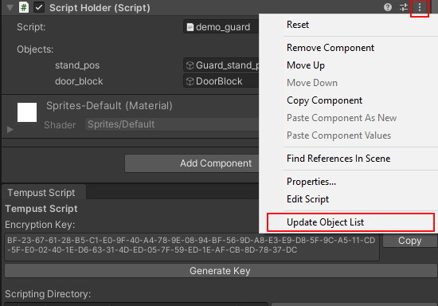

# The ScriptHolder Component
To attach a Tempust Script script to a Unity game object, use the ScriptHolder component. The game object will automatically run the "init" region on Start(), keep track of flags from the GameStateManager, and run the script when interacted with.

## TSInteractable
ScriptHolder implements the TSInteractable interface. TSInteractable contains a single OnInteract(GameObject interactor) method. 

The interactor parameter is the game object that calls OnInteract(). Calling OnInteract() assigns "plr" object to the interactor game object, then runs the script.

## Update Object List
The menu for the ScriptHolder component includes an option labeled "Update Object List". Clicking this creates a list of all objects defined in the script, allowing game objects to be assigned to each through the inspector.

## Customization
The ScriptHolder class doesn't currently support customization. However, this is planned for a future update.